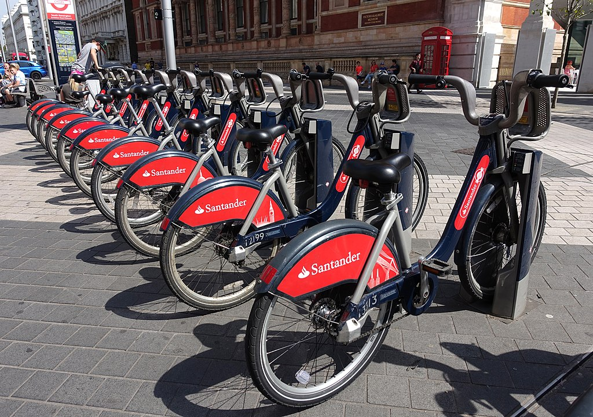
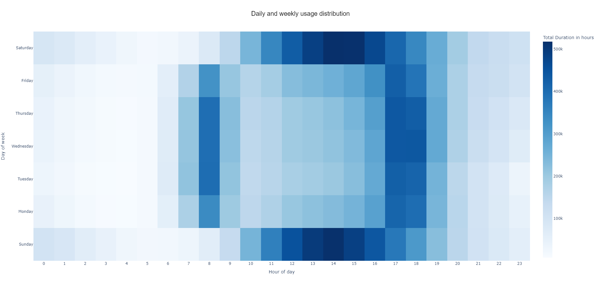
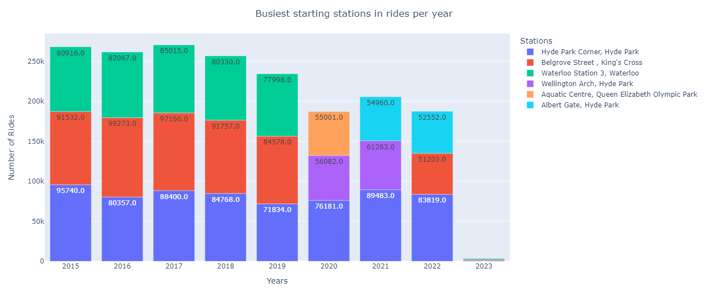
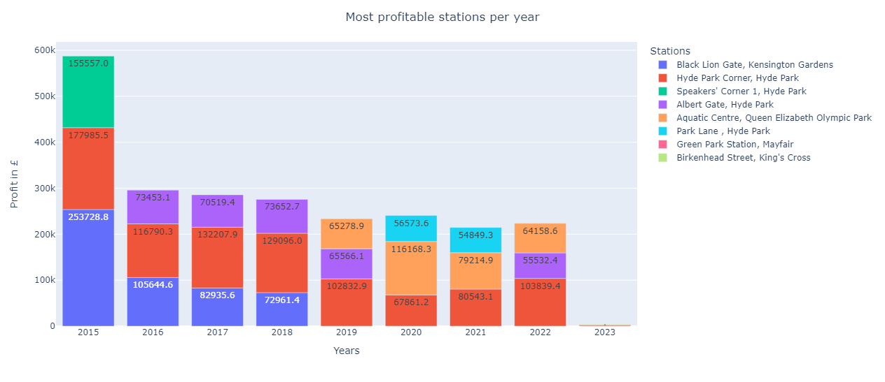

# **London Cycle Hire - Data Analysis and Demand Prediction**

---

## Contents
- [Overview](#Overview)
- [Data Source](#Data-Source)
- [ML Pipeline](#ML-Pipeline)
- [How to use](#How-to-use)
- [Contributing](#Contributing)

## Overview
This is an ML project where the "London Cycle Hire" data is analysed and a model is developed \
to predict the demand at the 20 busiest cycle stations of Santander Bikes. The pipeline contains \
all the necessary steps such as preprocessing, exploration and model development.

The data exploration shows strong time-of-day and day-of-week trends. \
Consequently, the current model is a useful tool for supply chain optimisation that may result in \
increasing the revenue and improving customer satisfaction 

The tools that are currently used for the development are BigQuery, Python and H2O.

## Data Source
The data contains information about the usage of London's Santander Cycle Hire Scheme from \
2011 to the current date. It comprises details such as the commencement and conclusion timestamps, \
station names, and the duration of rides. This publicly available dataset is accessible via Google \
BigQuery and falls within BigQuery's free tier, offering 1TB of monthly processing without cost.


This publicly available dataset is accessible via [Google BigQuery](https://console.cloud.google.com/marketplace/product/greater-london-authority/london-bicycles?hl=en-GB)


## ML Pipeline
The machine learning pipeline comprises several key steps, ensuring that the best possible model performance is achieved:

### Data Preprocessing: 
Data cleaning, handling of missing values, and data formatting are executed using BigQuery and Python, preparing the data for further analysis.

### Exploratory Data Analysis (EDA): 
The dataset's characteristics are deeply understood. Patterns and correlations within the data are identified through EDA, providing valuable insights for feature engineering and modelling.

- ### <span style="color:#32CD32">_Examples_ </span>

#### Daily and Weekly usage



#### Busiest starting stations in rides per year



#### Most profitable stations per year


### Feature Engineering:
the final features that are to be used for model training are crafted.

### Modeling: 
The classification model, designed to predict demand at the 20 busiest cycle stations, explores and experiments with various classification algorithms. H2O is employed as a powerful Auto-ML tool for building, training, and evaluating machine learning models.

## How to use

- Create virtual environment.
```
$ python -m venv my_venv_name
```
- Install requirements.
```
$ pip install -r requirements.txt
``` 
- Activate the virtual environment in Windows PowerShell
```
$ .\my_venv_name\Scripts\activate
``` 
---

- <span style="color:#ED8B00">_Running the whole pipeline result in creating and saving files._ </span>
- <span style="color:#ED8B00">_Modify the directory names in the config.yaml file._ </span>
- <span style="color:#ED8B00">_Run the main.ipynb file to run the whole pipeline._ </span>

## Contributing
Contributions from the community are welcomed to enhance the project. Pull requests can be submitted, \
improvements suggested, or issues reported. Together, the predictive model can be made even better.

